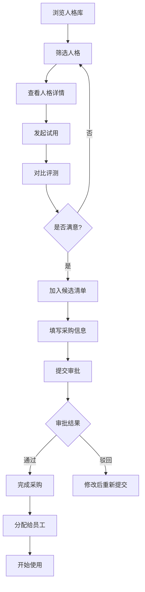
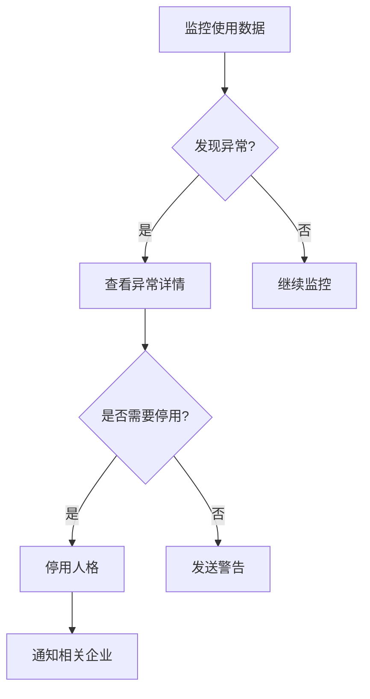

# AI 人格市场 - 产品需求文档

## 1. 产品概述

**AI 人格市场**是一个面向企业级客户的 AI 人格交易与服务平台，致力于帮助企业快速找到适合客服、销售陪练和培训讲师场景的 AI 人格解决方案。

- **核心目的**：降低企业 AI 人格筛选成本，提供透明的人格对比、试用和采购流程
- **目标用户**：企业采购负责人、HR 培训经理、客服主管、IT 管理员
- **市场价值**：提升企业 AI 部署效率，保障合规使用，量化 ROI

---

## 2. 功能模块

### 2.1 用户角色

| 角色 | 注册方式 | 核心权限 |
|------|----------|----------|
| 企业采购人 | 企业邮箱 + 管理员审批 | 浏览人格库、发起试用、加入候选清单、提交采购审批、分配给员工 |
| 企业管理员 | 系统初始化创建 | 额度管理、风险人格停用、查看使用数据、异常反馈处理、续约管理 |
| 超级管理员 | 系统初始化创建 | 全局配置、平台运营数据、用户管理 |

### 2.2 功能模块列表

1. **企业首页**：平台概览、推荐人格、快捷入口、使用统计
2. **人格库**：人格浏览、多维度筛选、详情查看、试用发起
3. **评测对比**：多 AI 人格同时回答同一问题、回答差异可视化
4. **候选清单**：收藏候选人格、采购申请填写、审批状态跟踪
5. **使用监控**：员工使用情况、满意度反馈、异常告警、额度预警
6. **管理后台**：额度设置、人格停用、数据统计、续约提醒

---

## 3. 核心流程

### 3.1 人格采购流程

### 3.2 管理员风险管控流程

---

## 4. 页面详细设计

### 4.1 企业首页

| 模块名称 | 功能描述 |
|----------|----------|
| 顶部导航栏 | Logo、企业名称、快捷入口、通知中心、用户头像 |
| 数据概览卡片 | 本月调用量、活跃人格数、平均满意度、待处理审批 |
| 推荐人格轮播 | 根据企业行业推荐的优质人格 |
| 快捷操作区 | 快速发起试用、查看候选清单、进入监控面板 |
| 使用趋势图 | 近30天调用量趋势 |
| 近期活动 | 最近的采购、审批、分配记录 |

### 4.2 人格库页面

| 模块名称 | 功能描述 |
|----------|----------|
| 筛选面板 | 行业（电商、金融、教育等）、任务类型（客服、销售、培训）、合规等级（S/A/B/C）、响应风格（专业型、亲和型、幽默型） |
| 人格卡片列表 | 头像、名称、标签、月调用量、评分、核心优势摘要 |
| 排序与视图切换 | 按热度、新上架、综合评分；列表/网格视图 |
| 详情弹窗 | 完整能力介绍、评测报告、价格策略、用户评价 |

### 4.3 评测对比页面

| 模块名称 | 功能描述 |
|----------|----------|
| 问题输入区 | 支持文本输入、历史问题模板 |
| 人格选择器 | 勾选2-5个待对比人格 |
| 对比展示区 | 并排展示各人格回答、支持折叠展开 |
| 差异高亮 | 关键词差异标色、重要维度打分对比 |
| 操作按钮 | 加入候选、立即采购、查看详情 |

### 4.4 候选清单页面

| 模块名称 | 功能描述 |
|----------|----------|
| 清单列表 | 已收藏人格、支持拖拽排序 |
| 采购申请表单 | 人格数量、用途描述、期望上线日期、预算范围 |
| 审批流程 | 当前状态、审批历史、驳回原因 |
| 分配管理 | 选择员工、设置使用权限、有效期设置 |

### 4.5 使用监控页面

| 模块名称 | 功能描述 |
|----------|----------|
| 实时数据大屏 | 当日调用量、并发数、响应时间 |
| 员工使用明细 | 员工姓名、使用人格、调用次数、满意度评分 |
| 满意度趋势 | 各人格满意度变化曲线 |
| 异常告警列表 | 问题描述、发生时间、影响范围、处理状态 |
| 额度预警 | 使用进度条、剩余额度、续费入口 |

### 4.6 管理后台

| 模块名称 | 功能描述 |
|----------|----------|
| 额度管理 | 企业额度配置、用量上限设置、预警阈值 |
| 人格管理 | 上架/下架人格、风险标签设置、合规审核 |
| 数据统计 | 全局调用量、活跃企业数、人格排行榜 |
| 续约管理 | 合同到期列表、自动提醒设置、续约操作 |
| 异常反馈 | 反馈列表、处理状态、回复记录 |

---

## 5. 设计风格规范

### 5.1 视觉风格

- **设计方向**：科技感与商务感融合，呈现专业、可信赖的企业级产品形象
- **色彩体系**：
  - 主色：深空蓝 `#1E3A5F`
  - 辅助色：科技青 `#00D4AA`
  - 强调色：警示橙 `#FF8C42`
  - 背景色：深灰 `#0F1419` / 浅灰 `#F5F7FA`
  - 文字色：主文字 `#1A1A2E` / 次要 `#6B7280`
- **字体**：
  - 标题：思源黑体 Bold / Noto Sans SC Bold
  - 正文：思源黑体 Regular / Noto Sans SC Regular
  - 数据：DIN Alternate / Roboto Mono
- **圆角**：卡片 `12px`，按钮 `8px`，输入框 `6px`
- **阴影**：统一使用 `0 4px 24px rgba(30, 58, 95, 0.12)` 卡片阴影

### 5.2 动效规范

- **页面切换**：淡入淡出 `300ms ease-out`
- **卡片悬停**：上浮 `transform: translateY(-4px)` + 阴影增强
- **数据加载**：骨架屏 + 渐显动画
- **对比展示**：交错入场动画 `stagger 100ms`
- **状态切换**：平滑过渡 `200ms ease`

### 5.3 响应式策略

- **桌面端优先**：`1200px` 以上为主，监控大屏适配
- **平板适配**：`768px-1199px` 侧边栏折叠为抽屉
- **移动端**：`768px` 以下简化展示，表格转为卡片列表

---

## 6. 数据指标体系

| 指标名称 | 定义 | 更新频率 |
|----------|------|----------|
| 调用量 | 每日/周/月 AI 人格被调用的总次数 | 实时 |
| 满意度评分 | 用户使用后1-5星评价的平均分 | 每日汇总 |
| 响应时间 | 从请求到首字返回的平均耗时 | 实时 |
| 异常率 | 异常调用占总调用的比例 | 实时 |
| 人格覆盖率 | 已分配员工占企业总员工的比例 | 每日 |
| 续约率 | 合同到期后续约的比例 | 每月 |

---

## 7. 合规与安全

- **数据隔离**：企业间数据完全隔离，互不可见
- **内容审核**：AI 回答实时接入内容审核 API，风险内容拦截
- **操作审计**：所有关键操作记录审计日志
- **权限控制**：基于角色的细粒度权限管理（RBAC）
- **传输加密**：全站 HTTPS + 请求签名验证
