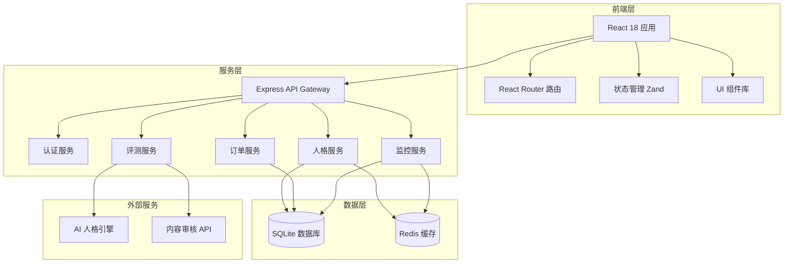
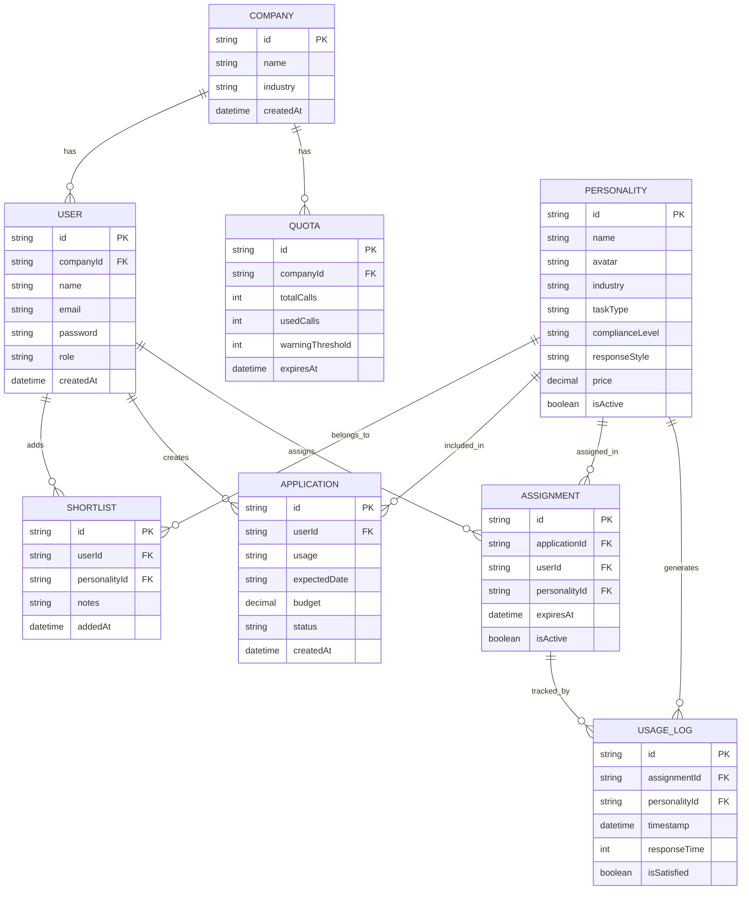

# AI 人格市场 - 技术架构文档

## 1. 架构设计



---

## 2. 技术栈

| 层级 | 技术选型 | 说明 |
|------|----------|------|
| 前端框架 | React 18 + TypeScript | 组件化开发，类型安全 |
| 构建工具 | Vite | 快速开发启动 |
| 路由管理 | React Router v6 | SPA 路由 |
| 状态管理 | Zustand | 轻量级状态管理 |
| UI 组件 | Tailwind CSS + Radix UI | 原子化 CSS + 无障碍组件 |
| 图表库 | Recharts | 数据可视化 |
| 后端框架 | Express.js | RESTful API |
| 数据库 | SQLite | 轻量级文件数据库 |
| 缓存层 | 内存缓存 | 模拟 Redis 行为 |
| 开发语言 | Node.js 18+ | 运行时环境 |

---

## 3. 路由定义

| 路由 | 页面名称 | 权限要求 |
|------|----------|----------|
| `/` | 企业首页 | 已登录 |
| `/personalities` | 人格库 | 已登录 |
| `/personalities/:id` | 人格详情 | 已登录 |
| `/compare` | 评测对比 | 已登录 |
| `/shortlist` | 候选清单 | 已登录 |
| `/shortlist/apply` | 采购申请 | 已登录 |
| `/monitor` | 使用监控 | 已登录 |
| `/admin` | 管理后台 | 管理员 |
| `/admin/quota` | 额度管理 | 管理员 |
| `/admin/personalities` | 人格管理 | 管理员 |
| `/admin/analytics` | 数据统计 | 管理员 |
| `/admin/renewals` | 续约管理 | 管理员 |
| `/login` | 登录页 | 公开 |

---

## 4. API 定义

### 4.1 认证相关

```typescript
// POST /api/auth/login
interface LoginRequest {
  email: string;
  password: string;
}

interface LoginResponse {
  token: string;
  user: UserInfo;
}

// GET /api/auth/me
interface UserInfo {
  id: string;
  name: string;
  email: string;
  role: 'purchaser' | 'admin' | 'super_admin';
  companyId: string;
}
```

### 4.2 人格相关

```typescript
// GET /api/personalities
interface PersonalityListRequest {
  industry?: string;
  taskType?: string;
  complianceLevel?: string;
  responseStyle?: string;
  page?: number;
  pageSize?: number;
}

interface Personality {
  id: string;
  name: string;
  avatar: string;
  tags: string[];
  industry: string;
  taskType: string;
  complianceLevel: 'S' | 'A' | 'B' | 'C';
  responseStyle: string;
  monthlyCalls: number;
  rating: number;
  price: number;
  description: string;
}

// GET /api/personalities/:id
interface PersonalityDetail extends Personality {
  capabilities: string[];
  evaluationReport: EvaluationReport;
  reviews: Review[];
}
```

### 4.3 评测相关

```typescript
// POST /api/evaluate
interface EvaluateRequest {
  question: string;
  personalityIds: string[];
}

interface EvaluateResponse {
  results: {
    personalityId: string;
    answer: string;
    scores: {
      accuracy: number;
      professionalism: number;
      friendliness: number;
    };
  }[];
}
```

### 4.4 候选清单相关

```typescript
// GET /api/shortlist
interface ShortlistItem {
  id: string;
  personality: Personality;
  addedAt: string;
  notes: string;
}

// POST /api/shortlist
interface AddToShortlistRequest {
  personalityId: string;
  notes?: string;
}

// POST /api/applications
interface PurchaseApplication {
  id: string;
  items: { personalityId: string; quantity: number }[];
  usage: string;
  expectedDate: string;
  budget: number;
  status: 'pending' | 'approved' | 'rejected';
}
```

### 4.5 监控相关

```typescript
// GET /api/monitor/usage
interface UsageStats {
  totalCalls: number;
  activePersonas: number;
  avgSatisfaction: number;
  pendingApprovals: number;
  trends: { date: string; calls: number }[];
}

// GET /api/monitor/employees
interface EmployeeUsage {
  id: string;
  name: string;
  assignedPersonas: string[];
  callCount: number;
  satisfaction: number;
}

// GET /api/monitor/alerts
interface Alert {
  id: string;
  type: 'anomaly' | 'quota_warning' | 'compliance';
  description: string;
  createdAt: string;
  status: 'open' | 'resolved';
}
```

---

## 5. 数据模型

### 5.1 ER 图



### 5.2 数据库表定义

```sql
-- 公司表
CREATE TABLE companies (
    id TEXT PRIMARY KEY,
    name TEXT NOT NULL,
    industry TEXT,
    created_at DATETIME DEFAULT CURRENT_TIMESTAMP
);

-- 用户表
CREATE TABLE users (
    id TEXT PRIMARY KEY,
    company_id TEXT REFERENCES companies(id),
    name TEXT NOT NULL,
    email TEXT UNIQUE NOT NULL,
    password TEXT NOT NULL,
    role TEXT CHECK(role IN ('purchaser', 'admin', 'super_admin')) DEFAULT 'purchaser',
    created_at DATETIME DEFAULT CURRENT_TIMESTAMP
);

-- 额度表
CREATE TABLE quotas (
    id TEXT PRIMARY KEY,
    company_id TEXT REFERENCES companies(id),
    total_calls INTEGER DEFAULT 10000,
    used_calls INTEGER DEFAULT 0,
    warning_threshold INTEGER DEFAULT 8000,
    expires_at DATETIME
);

-- 人格表
CREATE TABLE personalities (
    id TEXT PRIMARY KEY,
    name TEXT NOT NULL,
    avatar TEXT,
    industry TEXT,
    task_type TEXT,
    compliance_level TEXT CHECK(compliance_level IN ('S', 'A', 'B', 'C')),
    response_style TEXT,
    price DECIMAL(10, 2),
    monthly_calls INTEGER DEFAULT 0,
    rating DECIMAL(3, 2) DEFAULT 0,
    description TEXT,
    capabilities TEXT,
    is_active BOOLEAN DEFAULT 1
);

-- 候选清单表
CREATE TABLE shortlists (
    id TEXT PRIMARY KEY,
    user_id TEXT REFERENCES users(id),
    personality_id TEXT REFERENCES personalities(id),
    notes TEXT,
    added_at DATETIME DEFAULT CURRENT_TIMESTAMP
);

-- 采购申请表
CREATE TABLE applications (
    id TEXT PRIMARY KEY,
    user_id TEXT REFERENCES users(id),
    usage TEXT,
    expected_date DATE,
    budget DECIMAL(10, 2),
    status TEXT CHECK(status IN ('pending', 'approved', 'rejected')) DEFAULT 'pending',
    created_at DATETIME DEFAULT CURRENT_TIMESTAMP
);

-- 申请明细表
CREATE TABLE application_items (
    id TEXT PRIMARY KEY,
    application_id TEXT REFERENCES applications(id),
    personality_id TEXT REFERENCES personalities(id),
    quantity INTEGER DEFAULT 1
);

-- 分配表
CREATE TABLE assignments (
    id TEXT PRIMARY KEY,
    application_id TEXT REFERENCES applications(id),
    user_id TEXT REFERENCES users(id),
    personality_id TEXT REFERENCES personalities(id),
    expires_at DATETIME,
    is_active BOOLEAN DEFAULT 1
);

-- 使用日志表
CREATE TABLE usage_logs (
    id TEXT PRIMARY KEY,
    assignment_id TEXT REFERENCES assignments(id),
    personality_id TEXT REFERENCES personalities(id),
    timestamp DATETIME DEFAULT CURRENT_TIMESTAMP,
    response_time INTEGER,
    is_satisfied BOOLEAN
);

-- 告警表
CREATE TABLE alerts (
    id TEXT PRIMARY KEY,
    company_id TEXT REFERENCES companies(id),
    type TEXT CHECK(type IN ('anomaly', 'quota_warning', 'compliance')),
    description TEXT,
    status TEXT CHECK(status IN ('open', 'resolved')) DEFAULT 'open',
    created_at DATETIME DEFAULT CURRENT_TIMESTAMP
);

-- 索引
CREATE INDEX idx_users_company ON users(company_id);
CREATE INDEX idx_personalities_industry ON personalities(industry);
CREATE INDEX idx_personalities_task_type ON personalities(task_type);
CREATE INDEX idx_shortlists_user ON shortlists(user_id);
CREATE INDEX idx_usage_logs_assignment ON usage_logs(assignment_id);
```

---

## 6. 目录结构

```
ai-personality-market/
├── public/
│   └── index.html
├── src/
│   ├── components/
│   │   ├── common/           # 通用组件
│   │   │   ├── Button.tsx
│   │   │   ├── Card.tsx
│   │   │   ├── Input.tsx
│   │   │   ├── Modal.tsx
│   │   │   ├── Table.tsx
│   │   │   └── Badge.tsx
│   │   ├── layout/            # 布局组件
│   │   │   ├── Header.tsx
│   │   │   ├── Sidebar.tsx
│   │   │   └── PageContainer.tsx
│   │   ├── personality/       # 人格相关组件
│   │   │   ├── PersonalityCard.tsx
│   │   │   ├── PersonalityFilter.tsx
│   │   │   └── PersonalityDetail.tsx
│   │   ├── comparison/        # 对比组件
│   │   │   ├── QuestionInput.tsx
│   │   │   └── ComparisonResult.tsx
│   │   ├── monitor/           # 监控组件
│   │   │   ├── StatsCard.tsx
│   │   │   ├── UsageChart.tsx
│   │   │   └── AlertList.tsx
│   │   └── admin/             # 管理后台组件
│   │       ├── QuotaManager.tsx
│   │       └── AlertHandler.tsx
│   ├── pages/
│   │   ├── HomePage.tsx
│   │   ├── PersonalityLibraryPage.tsx
│   │   ├── ComparePage.tsx
│   │   ├── ShortlistPage.tsx
│   │   ├── ApplicationPage.tsx
│   │   ├── MonitorPage.tsx
│   │   ├── AdminPage.tsx
│   │   └── LoginPage.tsx
│   ├── services/              # API 服务
│   │   ├── api.ts
│   │   ├── authService.ts
│   │   ├── personalityService.ts
│   │   ├── shortlistService.ts
│   │   └── monitorService.ts
│   ├── stores/                # 状态管理
│   │   ├── authStore.ts
│   │   ├── personalityStore.ts
│   │   └── monitorStore.ts
│   ├── types/                 # 类型定义
│   │   └── index.ts
│   ├── utils/                 # 工具函数
│   │   ├── formatters.ts
│   │   └── validators.ts
│   ├── data/                  # 模拟数据
│   │   └── mockData.ts
│   ├── App.tsx
│   ├── main.tsx
│   └── index.css
├── server/                    # 后端服务
│   ├── index.js
│   ├── routes/
│   │   ├── auth.js
│   │   ├── personalities.js
│   │   ├── shortlist.js
│   │   ├── applications.js
│   │   └── monitor.js
│   ├── services/
│   ├── db/
│   │   ├── init.js
│   │   └── database.sqlite
│   └── middleware/
│       └── auth.js
├── package.json
├── vite.config.ts
├── tailwind.config.js
├── tsconfig.json
└── README.md
```

---

## 7. Mock 数据策略

由于是演示项目，后端使用 SQLite 存储基础数据，并通过初始化脚本预置：

- **5 家示例公司**：不同行业的代表企业
- **20+ 个 AI 人格**：覆盖客服、销售、培训三大场景
- **若干采购申请记录**：展示审批流程
- **使用统计数据**：模拟真实监控数据
- **告警示例**：展示异常处理场景
